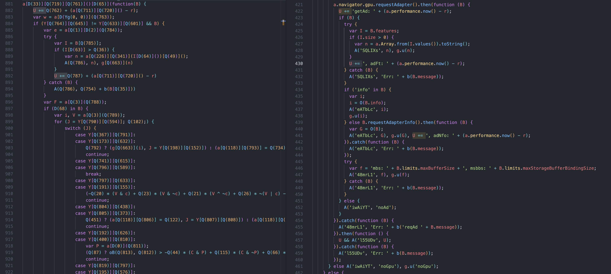

# new-datadome-deobfuscator

<div align="center">
  
  
  
  <a href="https://github.com/glizzykingdreko/new-datadome-deobfuscator"></a>
  <a href="https://github.com/glizzykingdreko/new-datadome-deobfuscator"></a>
</div>


<div align="center">
  <a href="https://www.npmjs.com/package/new-datadome-deobfuscator"></a>
  <a href="https://new-datadome-deobfuscator.glizzykingdreko.com"></a>
  <a href="#related-work"></a>
  <a href="https://buymeacoffee.com/glizzykingdreko"></a>
</div>
<br />

Babel AST-based deobfuscator for DataDome's WAFs (interstitial and captcha). Up to date and maintained for the latest versions. Clean files, extract dynamic challenges, pull out the embedded WASM payload.


**Before starting**

Please kepe in mind that this Datadome daily update their challenge files (new compilation, new functions/identifiers names + dynamic challenges suffled).
This repo has been done thanks to months of studying and analyzing their updates pattern and structures, with the goal of handling them correctly. Please leave a start and read my other works for supporting me,

[Live demo](https://new-datadome-deobfuscator.glizzykingdreko.com)

## Table of Contents

- [What gets deobfuscated](#what-gets-deobfuscated)
- [The logic, condensed](#the-logic-condensed)
- [Installing the module](#installing-the-module)
- [Use it as a node module](#use-it-as-a-node-module)
  - [Extracting the dynamic challenge](#extracting-the-dynamic-challenge-from-the-module)
  - [Extracting the WASM payload](#extracting-the-wasm-payload-from-the-module)
- [CLI usage](#cli-usage)
  - [Extracting dynamic challenge and WASM via CLI](#extracting-dynamic-challenge-and-wasm-via-cli)
- [Web UI](#web-ui)
- [Output shape](#output-shape)
- [Project structure](#project-structure)
- [What's not supported](#whats-not-supported)
- [Related work](#related-work)
- [Further reading](#further-reading)
- [Need DataDome Bypass Solutions?](#need-datadome-bypass-solutions)
- [License & author](#license--author)

## What gets deobfuscated

Two scripts, one pipeline:

- **captcha.js**, the Webpack/Browserify-style bundle DataDome serves on the captcha page
- **interstitial.js**, the anonymous-IIFE bundle served on the interstitial WAF page

Both come out as clean, per-module files. Plus the post-processing extracts the per-session **dynamic challenge** expression and the embedded **WASM payload + helpers** that the bundle uses to compute its detection signature.

Pre vs post here:



## The logic, condensed

So, DataDome is still using the same old obfuscation techniques, the only update they push sometime is another layer or operation just on top of the previous ones. Usually updating the deobfuscator means having just to handle a new layer or function concatenation.

The pipeline runs in eight phases:

### 1. **Hex and bracket cleanup**
`\x48\x65\x6c\x6c\x6f` → `"Hello"`
`obj[['key']]` → `obj['key']`

### 2. **Module separation**
Detects which bundle shape lives at `program.body[0]` and splits the IIFE / function body into per-module ASTs. Captcha is a browserify-style `!function(e,B,s){...}({...})`, interstitial is a `(function(){ var e={...}; ... })()`.

```js
! function A(Q, t, C) {
    // Modules handler function
}({
    1: [function(A, Q, t) { /* Module with exports */ }, {}],
    2: [function(A, Q, t) { /* Module with exports */ }, {}],
    ...
}, {}, [6]); // Entry point (Module 6 in this case)
```

After separation you get something like:

```
output/captcha/
  captcha.js
  vm-obf.js
  bean.js
  hash.js
  helpers.js
  main.js
  mouseMaths.js
  picasso.js
  slidercaptcha.js
```

### 3. **T-matrix resolution**
DataDome precomputes a 2D array whose cells are references to row-arrays, then uses `<matrix>[x][y]` everywhere as case values and table keys. The pass extracts the `var e = (function(){...})()` IIFE that builds it, runs that IIFE in a Node `vm` context, and rewrites every `e[x][y]` lookup to the small integer it actually represents. I call this TMatrix. I've already analyzed this logic in a [previous article and repo](https://github.com/glizzykingdreko).

### 4. **String cleaning**
Variables like `let x = window.Number(-92)` get executed and replaced inside the correct scope. We then have function calls like `fn(numLit, numLit)` (the actual string obfuscators) that now have their arguments displayed as literals, so we can fold them into their resulting strings.

### 5. **Executions and replacements**
T-matrix replacement, conditional and expression simplification, if-statement folding, opaque-predicate folding. Up to 10 rounds, until nothing changes.

### 6. **Arithmetic expression removal**
Removal of "Mixed Boolean-Arithmetic" expressions like `-3*(F&-881) + 1*~(F&o) + ... > -388`. The pass samples each one across 20+ random integer assignments. If it's invariant, replace with the literal. If it's linear, fit `a*x + b*y + c`. (Random operations meant to "make the code hard to understand", we just sample our way through them.)

### 7. **Switch-case unflattening, twice**
`for (r = N; true;) { switch (r) { case X: ...; r = Y; continue; ... } }` is flattened back into linear code. The first run handles straightforward cases. Then unused-variable removal strips the decoy for-inits DataDome pads in (`for (var eA = 544; true;)` where `eA` is never used and the real state lives in `r`), and the second run picks up whatever was hiding behind those decoys.

### 8. **Code generation + post-processing extractors**
One file per separated module. Then `extractDynamicChallenge`, `extractWasm`, and `extractWasmChallengeFields` walk the cleaned ASTs and pull out the per-session signature expression, the embedded WASM bytes, and the ordered list of fields the WASM hashes. Those land on the result object directly (see [Use it as a node module](#use-it-as-a-node-module)).

For the full per-phase walkthrough, the rationale behind each guard, and the historical fixes log, see [LEARN.md](./LEARN.md).

## Installing the module

```bash
npm install new-datadome-deobfuscator
```

Node 18 or newer. No native deps.

## Use it as a node module

```js
const fs = require('fs');
const { deobfuscate } = require('new-datadome-deobfuscator');

const source = fs.readFileSync('captcha.js', 'utf8');
const result = deobfuscate(source, { logLevel: 'INFO' });

console.log(result.bundleType);             // 'captcha' | 'interstitial' | 'unknown'
console.log(result.moduleOrder);            // ['captcha', 'vm-obf', 'bean', ...]
console.log(result.stats.reductionPercent); // '12.33%'

for (const [name, code] of Object.entries(result.modules)) {
  fs.writeFileSync(`out/${name}.js`, code);
}
```

The result object:

| field | type | what it is |
|---|---|---|
| `bundleType` | string | `'captcha'`, `'interstitial'`, or `'unknown'` |
| `modules` | object | `{ moduleName: deobfuscatedSource }` |
| `moduleOrder` | string[] | original emission order |
| `dynamic_challenge` | string \| null | the bit-twiddle expression DataDome computes per session for its request signature |
| `wasm` | object \| null | extracted WASM payload + helper metadata + hashed-fields list |
| `stats` | object | `{ original, deobfuscated, reduction, reductionPercent }` |
| `warnings` | array | non-fatal issues |
| `errors` | array | fatal issues with `code` and `message` |
| `report` | object | structured report for downstream tooling |

Options:

| option | default | meaning |
|---|---|---|
| `logLevel` | `'INFO'` | `'DEBUG' \| 'INFO' \| 'WARN' \| 'ERROR' \| 'NONE'` |
| `logger` | (built-in) | bring your own Logger instance, overrides `logLevel` |
| `maxPasses` | `10` | iterative-pass cap |
| `generatorOptions` | (none) | forwarded to `@babel/generator` |

### Extracting the dynamic challenge from the module

`result.dynamic_challenge` is a string containing the exact bit-twiddling expression DataDome runs per session over `(build-sig, br_ow, br_oh, hardwareConcurrency)` to produce its request signature. Decoder calls inside the expression are pre-resolved to literals, and the locally-named source arrays are renamed to consistent identifiers, so what you get is portable: drop it into your own solver and run it.

```js
const { deobfuscate } = require('new-datadome-deobfuscator');
const fs = require('fs');

const source = fs.readFileSync('captcha.js', 'utf8');
const result = deobfuscate(source);

if (result.dynamic_challenge) {
  // The expression as JS source. Plug into your solver / VM.
  console.log(result.dynamic_challenge);

  // Or persist for later replay
  fs.writeFileSync('out/dynamic_challenge.js', result.dynamic_challenge);
} else {
  console.warn('no dynamic challenge found, check warnings:', result.warnings);
}
```

Returns `null` when the extractor can't locate the call (rare, and usually means a new variant shape, check `result.warnings`).

### Extracting the WASM payload from the module

`result.wasm` is the full WASM blob: the raw base64 bytes, the imports-provider source (so you can rebuild the import object), the list of `window.*` properties the provider touches, every external helper the provider transitively calls, and the ordered list of fields the compiled WASM actually hashes.

```js
const { deobfuscate } = require('new-datadome-deobfuscator');
const fs = require('fs');

const source = fs.readFileSync('captcha.js', 'utf8');
const result = deobfuscate(source);

if (result.wasm) {
  const { wasm, instance, providerName, windowAttributes, helpers, fields } = result.wasm;

  // 1. Save the raw WASM bytes
  fs.writeFileSync('out/datadome.wasm', Buffer.from(wasm, 'base64'));

  // 2. Save the imports-provider so you can rebuild the import object
  fs.writeFileSync('out/imports-provider.js', instance);

  console.log('provider name:', providerName);
  console.log('window attrs touched:', windowAttributes);
  console.log('external helpers:', helpers.map(h => h.name));
  console.log('hashed fields:', fields); // e.g. ['hardwareConcurrency', 'br_oh', 'maxTouchPoints', ...]
}
```

The `wasm` object shape:

| field | type | what it is |
|---|---|---|
| `wasm` | string | raw WASM module, base64-encoded (starts with `AGFzbQ`) |
| `instance` | string | source code of the imports-provider function |
| `providerName` | string | name of the imports-provider in the original bundle |
| `windowAttributes` | string[] | `window.*` properties the provider touches (`DataView`, `Uint32Array`, `Error`, …) |
| `helpers` | array | `{ name, source }` for every external helper the provider calls |
| `fields` | string[] | ordered list of field names hashed by `wasm_b` (e.g. `hardwareConcurrency`, `br_oh`, `maxTouchPoints`) |

Returns `null` when the bundle has no embedded WASM or the extractor hits an unfamiliar shape.

**NOTE** The fields of the `wasm_boring` challenge changes daily, that's why we extract them alongisde the dynamic helpers, instance and windows attrs

## CLI usage

```bash
# direct
npx datadome-deobfuscate input.js out/

# with a structured report on the side
npx datadome-deobfuscate input.js out/ --report out/report.json
```

Flags:

| flag | meaning |
|---|---|
| `--input <path>` | alternative to the positional input argument |
| `--output <path>` | alternative to the positional outputPrefix argument |
| `--report <path>` | writes the full structured report (timestamp, per-module status, stats, errors, warnings, dynamic_challenge, wasm) |
| `--log-level <LEVEL>` | `DEBUG \| INFO \| WARN \| ERROR \| NONE`, default `INFO` |
| `--no-delimiter` | suppresses the `===DEOBFUSCATOR_RESULT===` line on stdout |
| `-h`, `--help` | usage |

Exit codes:

| code | meaning |
|---|---|
| 0 | clean run, no errors (warnings tolerated) |
| 1 | fatal error: bad input, parse failure, or unexpected crash |
| 2 | finished, but at least one module recorded errors |

The line right after `===DEOBFUSCATOR_RESULT===` on stdout contains the same JSON the `--report` flag writes to disk. That's the contract for downstream tooling that wants to scrape the output without writing files:

```python
report = json.loads(
    out.split('===DEOBFUSCATOR_RESULT===', 1)[1].strip().splitlines()[0]
)
if report['status'] != 'success':
    for e in report['errors']:
        print(e['message'])
```

Suppress the delimiter with `--no-delimiter` if you don't want it in the stdout stream.

### Extracting dynamic challenge and WASM via CLI

The post-processing extractors run automatically on every CLI invocation. The dynamic challenge expression and the full WASM blob land in the structured report on disk (and on the stdout delimiter line). No extra flags needed.

```bash
npx datadome-deobfuscate input/captcha.js out/captcha/ --report out/captcha/report.json
```

Then read the bits you care about:

```bash
# just the dynamic challenge expression
jq -r '.dynamic_challenge' out/captcha/report.json > out/dynamic_challenge.js

# the raw WASM bytes (base64-decoded)
jq -r '.wasm.wasm' out/captcha/report.json | base64 --decode > out/datadome.wasm

# the imports-provider source code
jq -r '.wasm.instance' out/captcha/report.json > out/imports-provider.js

# the ordered list of fields the WASM hashes
jq -r '.wasm.fields[]' out/captcha/report.json
```

Or if you're piping without writing to disk, scrape the stdout delimiter:

```bash
npx datadome-deobfuscate input/captcha.js out/captcha/ \
  | sed -n '/===DEOBFUSCATOR_RESULT===/{n;p;}' \
  | jq '{ dc: .dynamic_challenge, wasm_fields: .wasm.fields }'
```

Both `dynamic_challenge` and `wasm` always appear at the top level of the report payload, regardless of which module they were extracted from.

## Web UI

The repo doubles as a Vercel-deployable dashboard. Drop a captcha or interstitial file in the browser, watch the pipeline run, get the modules back as a zip.

Locally:

```bash
git clone https://github.com/glizzykingdreko/new-datadome-deobfuscator
cd new-datadome-deobfuscator
npm install
npm run dev
# → http://localhost:3000
```

Production:

```bash
npm i -g vercel
vercel deploy
```

## Output shape

| bundle | modules emitted |
|---|---|
| **captcha** | `captcha`, `vm-obf`, `bean`, `hash`, `helpers`, `main`, `mouseMaths`, `picasso`, `slidercaptcha` |
| **interstitial** | `reloader`, `interstitial`, `obfuscate`, `helpers`, `vm-obf`, `localstorage`, `main` |

Plus, when present:

- `dynamic_challenge`: the bit-twiddle expression DataDome computes per session for its request signature.
- `wasm`: the embedded WASM module's bytes plus extracted helper metadata (provider name, window attributes touched, external helpers, hashed-fields list).

## Project structure

```
new-datadome-deobfuscator/
  lib/index.js                Public Node.js API. deobfuscate(source, options).
  bin/cli.js                  CLI entry point.
  api/deobfuscate.js          Vercel serverless function. Streaming + non-streaming.
  api/deobfuscate-worker.js   Worker thread that runs the pipeline and streams logs.
  server.js                   Local dev server. Serves public/, routes /api/deobfuscate.
  public/                     Web UI. index.html, styles.css, app.js.
  transformers/
    index.js                          Pipeline runner.
    captcha.js                        Bundle-shape detection + module separation.
    preprocessing/index.js            Phases 1 through 7 + recursive harvest.
    transformations/                  One file per pass: t-matrix, switch-case, opaque-predicates, ...
    extractDynamicChallenge.js        Pulls out the per-session bit-twiddle expression.
    extractWasm.js                    Extracts WASM bytes + imports provider + helpers.
    extractWasmChallengeFields.js     Reads the ordered field list fed into wasm_b().
  input/                      Reference obfuscated bundles.
  output/                     Reference deobfuscated output.
  LEARN.md                    Per-phase walkthrough + historical fixes log.
  CLAUDE.md                   Agent instructions for this codebase.
```

## What's not supported

- **DataDome `tags.js`**, the third client-side script DataDome ships. Different bundle shape, different decoder location. Not in scope here.
- **Decoder calls with non-numeric args**, `C(someVar)` where `someVar` isn't a literal stays as-is.
- **For-loop state machines with dynamic initial state**, if the initial state expression contains a decoder call that can't resolve, the unflattener skips that loop. Currently 0 such skips on the reference inputs.

## Related work

Other DataDome work I've published, all open-source:

- [datadome-wasm](https://github.com/glizzykingdreko/datadome-wasm): the embedded WASM module reverse-engineered standalone.
- [datadome-encryption](https://github.com/glizzykingdreko/datadome-encryption): DataDome's request-payload encryption logic, Node.
- [datadome-encryption-python](https://github.com/glizzykingdreko/datadome-encryption-python): same encryption logic ported to Python.
- [Datadome-GeeTest-Captcha-Solver](https://github.com/glizzykingdreko/Datadome-GeeTest-Captcha-Solver): solver for the GeeTest variant of DataDome's captcha.
- [Datadome-Movements-Display](https://github.com/glizzykingdreko/Datadome-Movements-Display): visualizer for the mouse-movement signals DataDome collects.

Older repos, kept for reference but **superseded by this one**:

- [Datadome-Deobfuscator](https://github.com/glizzykingdreko/Datadome-Deobfuscator) (Oct 2023, outdated)
- [Datadome-Interstitial-Deobfuscator](https://github.com/glizzykingdreko/Datadome-Interstitial-Deobfuscator) (Jan 2024, outdated)
- [Datadome-Captcha-Deobfuscator](https://github.com/glizzykingdreko/Datadome-Captcha-Deobfuscator) (Jan 2024, outdated)
- [Datadome-Interstital-Encryptor](https://github.com/glizzykingdreko/Datadome-Interstital-Encryptor) (outdated)

Other antibot vendors, same pattern:

- [akamai-script-patcher](https://github.com/glizzykingdreko/akamai-script-patcher): Akamai bot-management script deobfuscator + integrity-check patcher.
- [akamai-v3-deobfuscator](https://github.com/glizzykingdreko/akamai-v3-deobfuscator): Akamai v3 sensor data trace and reconstruction.
- [akamai-v3-tools](https://github.com/glizzykingdreko/akamai-v3-tools): Akamai v3 sensor data encrypt / decrypt web UI.

## Further reading

- [LEARN.md](./LEARN.md): the deep dive. Per-phase rationale, the obfuscation patterns DataDome stacks, the corruption guards in Phase 4, the recursive harvest, the switch-case red-herring for-init handling, the post-processing extractors, and the fixes log.
- [Analyzing DataDome's latest changes](https://medium.com/@glizzykingdreko/analyzing-datadome-latest-changes-424f385bcdd4): Medium write-up on the most recent obfuscator updates.
- [Breaking down DataDome's captcha WAF](https://medium.com/@glizzykingdreko/breaking-down-datadome-captcha-waf-d7b68cef3e21): Medium walkthrough of the captcha bundle's structure.

## Need DataDome Bypass Solutions?

Get in touch with some experts who truly understand the technology, don't think you want to have your project down each time Datadome pushes a change.


At [TakionAPI](https://takionapi.tech) we provide it. Be sure to check it out, start a [free trial](https://dashboard.takionapi.tech) and then proceed checking out [our documentation](https://docs.takionapi.tech), one api call and Datadome is not a problem you need to worry about anymore.

Check our [datadome-bypass-examples](https://github.com/glizzykingdreko/datadome-bypass-examples) and be sure to [start a free trial](https://dashboard.takionapi.tech) for testing them.

## License & author

MIT. Author: **glizzykingdreko**.

- [GitHub](https://github.com/glizzykingdreko)
- [Twitter](https://mobile.twitter.com/glizzykingdreko)
- [Medium](https://medium.com/@glizzykingdreko)
- [Email](mailto:glizzykingdreko@protonmail.com)
- [Buy me a coffee ❤️](https://www.buymeacoffee.com/glizzykingdreko)
- [TakionAPI](https://takionapi.tech)

---

This repo is the open-source companion to **TakionAPI's DataDome solving API**. If you don't want to wire up the full bypass yourself, [TakionAPI](https://takionapi.tech) ships a ready-to-plug solver.